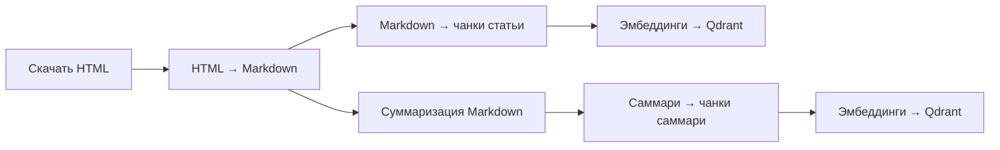

# Пайплайн Temporal

Схема пайплайна Temporal для обработки статьи: скачивание HTML, преобразование в Markdown, создание чанков статьи и саммари, вычисление эмбеддингов и сохранение в Qdrant.

```mermaid
flowchart LR
    A["Скачать HTML"] --> B["HTML → Markdown"]
    B --> C["Markdown → чанки статьи"]
    C --> D["Эмбеддинги → Qdrant"]
    B --> E["Суммаризация Markdown"]
    E --> F["Саммари → чанки саммари"]
    F --> G["Эмбеддинги → Qdrant"]
```
